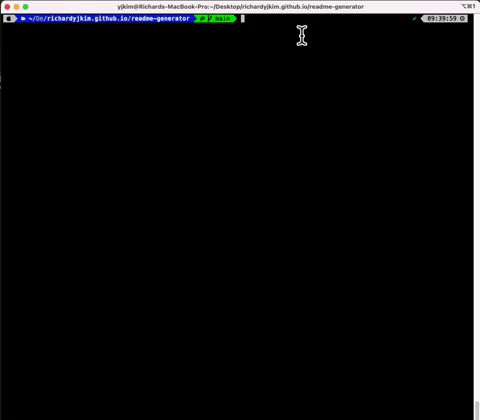
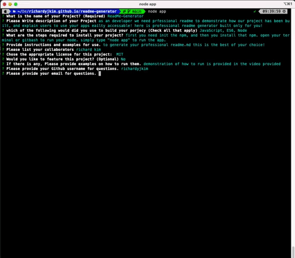

  # Readme-Generator

   
  ## Description 

  An an Developer, we may need professional readme to demonstrate how our project has been built, and explain users to use your master-piece eaily accessable! Here is professional readme-generator built just only fot you!

  ## Table of Contents
  
  - [Installation](#installation)
  - [Technology](#technology)
  - [Usage](#usage)
  - [Credit](#credit)
  - [License](#license)
  - [Feature](#feature)
  - [Test](#test)
  - [Questions](#questions)

  ## Installation

  First, you need to download node to run the program, open your terminal or command line, simply type "node app" to run the program and answer the following. 

  ## Technology
  JavaScript,ES6,Node

  ## Usage 

  To generate your professional readme.md this may be the best of your choice!

  ## Credits

  Richard Kim

  ## License

  this project is cover under MIT License (https://choosealicense.com/licenses/MIT/)

  ## Feature 

  

  ## Test 

  Demonstration of how to use is in the video provided

   
  
  

  

  ## Questions
  
  If you have any Questions, please do not hesitate to contact me one: 
  
  -Github: [richardyjkim](https://github.com/richardyjkim)
  
  -Email: richardyjkim@gmail.com
  